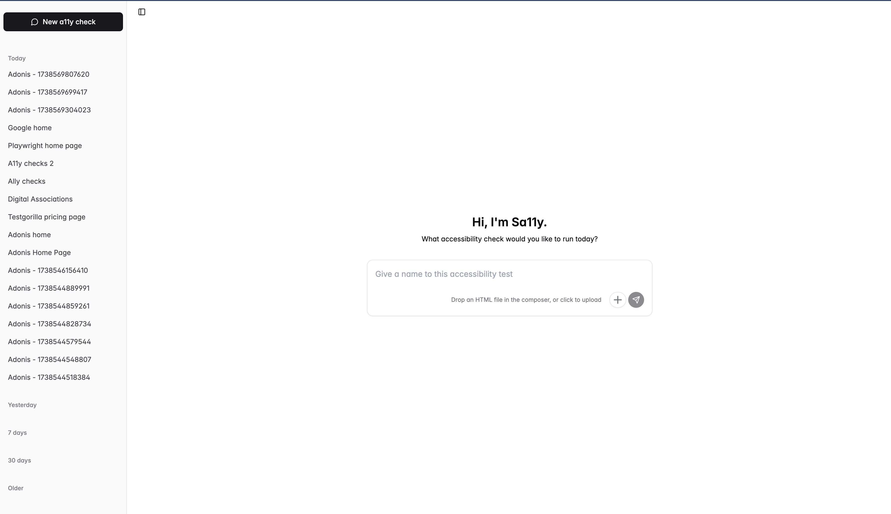
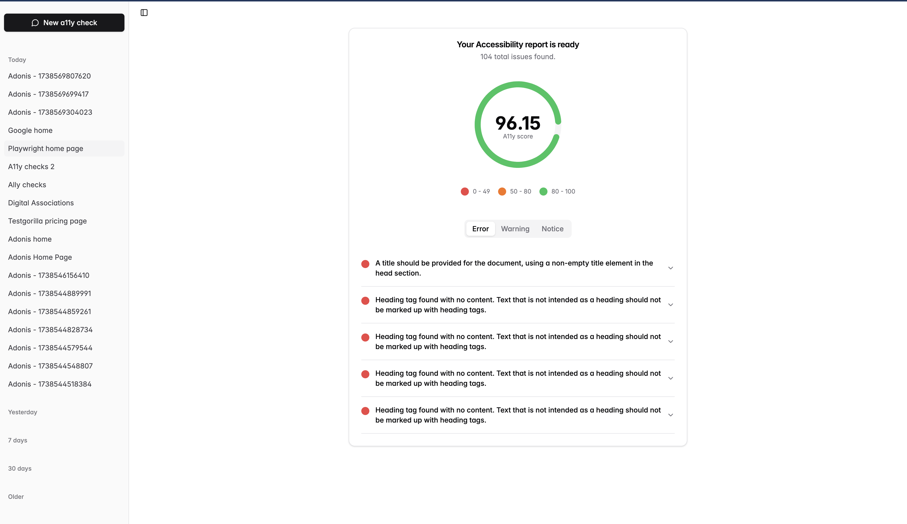
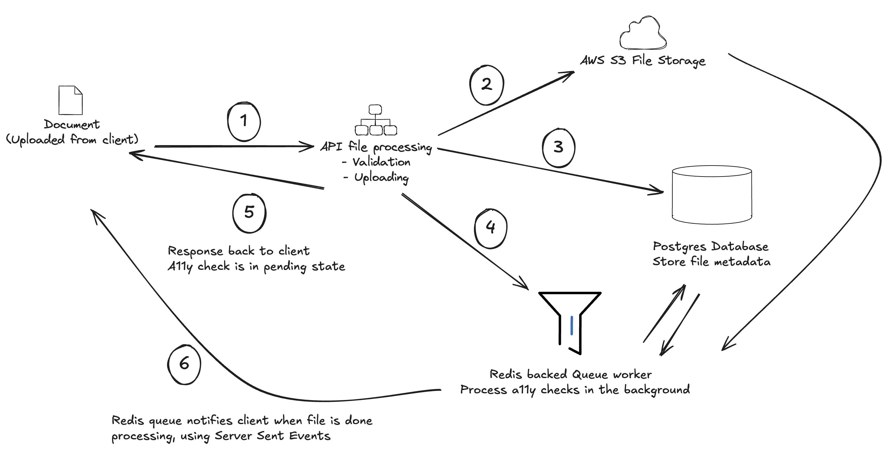
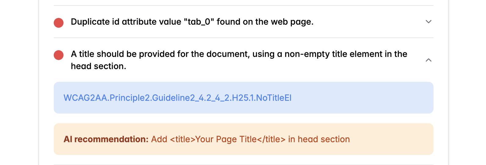

# Sa11y - check and score the accessibility of any HTML document

Sa11y is a comprehensive accessibility testing platform that helps you check and score the accessibility of HTML documents. The platform consists of two main components: a backend API (sa11y-api) and a frontend client (sa11y-client).

- [View the hosted API application](https://sa11y-api.ikigaya.dev/)
- [View the hosted client application](https://sa11y-app.ikigaya.dev/)




## The System design architecture for file uploads

Here's an image that summarises the process:



1. We receive a file upload on the backend API at the route `POST /api/v1/a11y-checks`
2. We perform basic file type and file size Validation
3. We upload the file to a private unlisted S3 private bucket
4. We insert a new row into the database for this newly created check
5. We dispatch a queue job called `ProcessA11yCheckJob` to process this job in the background.
6. The queue job processes the file, and after it is completed, it sends a server sent event to the client to notify that the job is completed.

## The Backend (sa11y-api)

### Technology Stack

- **[AdonisJS](https://adonisjs.com/)** - A fully-featured Node.js web framework
  - Chosen for its robust TypeScript support, built-in features, and excellent developer experience
- **PostgreSQL** - Primary database
- **Redis** - Used for queues and real-time updates
- **Bull Queue** - Background job processing
- **Puppeteer** - Headless browser automation for accessibility testing
- **Vine** - Validation library
- **Japa** - Testing framework
- **Transmit** - A library to make Server Sent Events seamless
- **pnpm** - Fast, easy to use alternative to the default NodeJS
- **AWS S3** - Secure file storage in the cloud

### Setup

1. Install dependencies:

```bash
cd sa11y-api
pnpm install
```

2. Configure environment:

```bash
cp .env.example .env
```

Modify the environment variables to match your environment. Most importantly, you'll be needing credentials to a Postgres and Redis database.

### Running the API

The scripts section of `package.json` file will provide you with all the commands you need for running the server in development, production, building, testing, linting, formatting and typechecking the backend codebase.

```json
"start": "node bin/server.js",
"build": "node ace build",
"dev": "node ace serve --hmr",
"test": "node ace test",
"lint": "eslint .",
"format": "prettier --write .",
"typecheck": "tsc --noEmit",
"queue:run": "node ace queue:listen"
```

## The Frontend (sa11y-client)

### Technology Stack

- React - UI library
- Vite - Build tool and development server
- React Query - Seamless data fetching and state management
- React Router - Client-side routing
- Radix UI & ShadCN UI - Accessible component primitives (Radix UI) with a nice starter UI (ShadCN)
- Tailwind CSS - Utility-first CSS framework
- Playwright - E2E testing
- Vitest - Unit & component integration testing
- Testing Library - Component testing utilities for accessible component testing practices

### Running the client

The scripts section of `package.json` file will provide you with all the commands you need for running the server in development, production, building, testing, linting, formatting and typechecking the backend codebase.

```json
"dev": "vite",
"build": "tsc -b && vite build --mode=prod",
"lint": "eslint .",
"test": "vitest --run",
"test:e2e": "playwright test",
"preview": "vite preview"
```

# The a11y check process and scoring system

This codebase is built using some familiar software engineering patterns like the factory, resolver and contract patterns. Thanks to this, it is incredibly easy to add new a11y runners. They would just need to implement the `A11yRunnerContract` contract.

As a foundation, we will be writing at least one runner for the codebase, which is called `HTML CodeSniffer`.

1. To perform A11y checks, this codebase uses [HTML CodeSniffer](https://squizlabs.github.io/HTML_CodeSniffer/Standards/WCAG2/). This library already has great support for WCAG 2.1 A11y standards, so saves a lot of time.

2. This codebase renders the uploaded HTML in a real browser so we can get the best results as A11y results should be as close to the user's experience as possible. It then loads the Code sniffer script into the browser and executes the a11y tests, and returns the result.

3. The results are stored in the database for future access and score calculation.

## Calculating the a11y score.

The `A11yScoreCalculatorService` is in charge of calculating the a11y score of an HTML document based on the results of the a11y checks.

It uses a simple but effective algorithm.

- First, it separates all a11y reported issues into 3: critical, severe and minor. The more critical issues have the most negative impact on the final a11y score. The severe issues have a moderate negative impact on the final a11y score, while the minor issues have a minimal to no negative impact on the a11y score.

- In order to apply `negative impact` , we assign weights to each issue category. The less the weight, the more it be able to tank the final score towards zero.

  - Critical issues - 0.4 weight
  - Severe issues - 0.8 weight
  - Minor issues - 1 weight

- Here's an example calculation using the weighted algorithm:
  - A11y results: 5 critical, 1 severe, 0 minor
  - - Total issues = 6
  - - Weighted sum = (5 _ 0.4 + 1 _ 0.8) = 2.8
  - - Average = 2.8 / 6 = 0.47
  - - Final score = 47%

# Deployment to the cloud

The hosted application and API are both on a VPS bought from Hetzner. The cloud set up uses the following technologies:

- Postgres database running on the same server (protected by firewalls, secure passwords, restricted access)
- Redis database running on the same server (protected by the same)
- Nginx for reverse proxying api calls and static hosting the frontend application
- Let's Encrypt for managing SSL certificates for both applications
- PM2 for running the backend API in cluster mode for minimal redundancy
- Supervisor for running the background queue worker

This application is designed to be able to horizontally scale easily, and we can achieve that in this way:

- Dockerising the NodeJS API
- Running multiple instances of the image on Railway or Kubernetes
- Running multiple instances of the image as a queue worker
- Separating Redis and Postgres into their own vps servers or hosted cloud database solutions

# Enhancements with Artificial intelligence

With LLMS, we can get the most critical accessibility issues, pass in some context around the WCAG rule and element, and ask the LLM to make highly accurate recommendations on how to fix these issues.



On the composer, if the user selects `Enhance a11y recommendations with ai`, after running the a11y checks, we call the LLM with a list of all the critical issues and use a prompt and structured output to ask the LLM to make recommendations on how to fix these issues.

# Improvements in the future

- [ ] Add a failed state on the frontend when a job fails. The backend already tracks failures and reason for failure during job execution, and broadcasts them to the frontend, but the frontend does not display them yet.
- [ ] More E2E, Integration, API and unit tests
- [ ] Containerise the applications for easy scaling and portability
- [ ] Fix a bug noticed in the Adonis Framework - Uploading an empty multipart form causes the entire request to just freeze with no response
- [ ] Add token API validation for better rate limiting (Super easy to do with AdonisJS as it has first party support)

# Docker and containerisation

In order to horizontally scale, we've dockerised the application to create a portable image. Platforms like Kubernetes, Nomad or Railway (Managed PAAS) can easily execute and scale instances of the resulting image.

## Backend image build.

To build the backend image, run the following command at the root of the backend API folder:

```bash
docker build -t sa11y-api .
```

After that you may execute the resulting build image using the following command. Be sure to define all needed environment variables in order to run the container correctly. You may see the needed environment variables in the `.env.example` file.

```
docker run -p 8080:8080 \
  -e ENV_1=xxx \
  -e ENV_2=xxx \
sa11y-api
```
